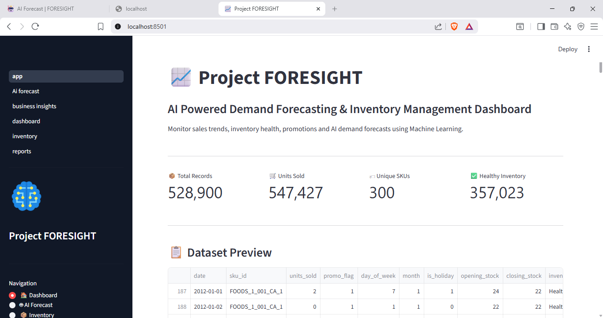
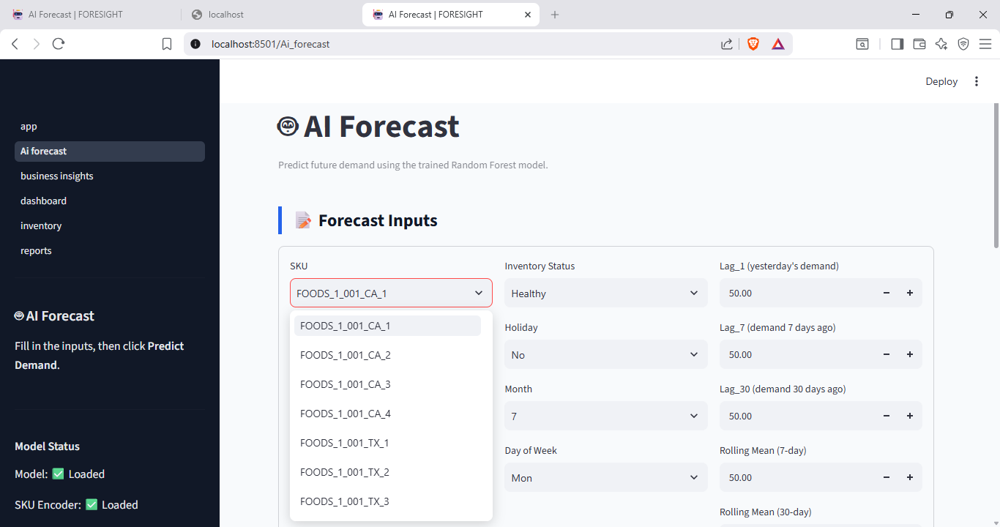
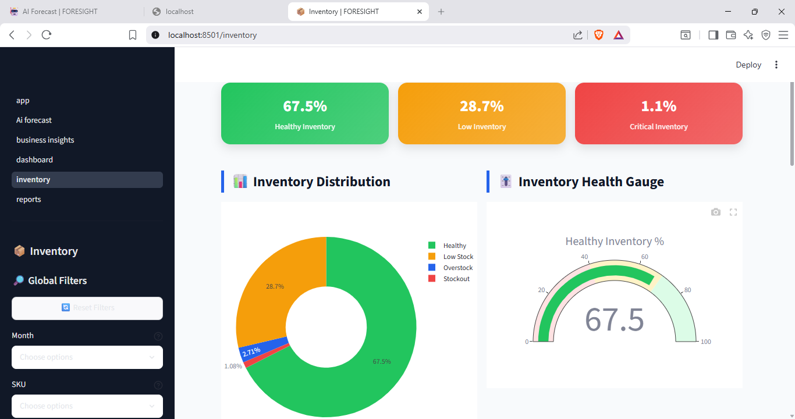

<div align="center">

# 🚀 dasboard_ds

### AI-Powered Demand Forecasting & Inventory Optimization Dashboard

<p align="center">
An end-to-end Machine Learning and Business Intelligence solution for forecasting product demand, optimizing inventory, and enabling data-driven business decisions.
</p>

<p align="center">


</p>

<p align="center">

⭐ Star this repository if you found it useful!

</p>

</div>

---

# 📑 Table of Contents

- Overview
- Problem Statement
- Solution
- Key Features
- Dashboard Preview
- Technology Stack
- Machine Learning Workflow
- Project Architecture
- Project Structure
- Installation
- Business Benefits
- Future Enhancements
- Learning Outcomes
- Author

---

# 📖 Overview

Project FORESIGHT is an end-to-end Machine Learning application that predicts future product demand and provides inventory optimization insights through an interactive Streamlit dashboard.

The project combines:

- Data Cleaning
- Exploratory Data Analysis
- Feature Engineering
- Machine Learning
- Business Intelligence
- Interactive Visualization

into one complete analytics platform.

The primary objective is to help businesses improve inventory planning, reduce operational costs, and make informed decisions using predictive analytics.

---

# 🎯 Problem Statement

Businesses often struggle with:

- Overstocking products
- Stock shortages
- Poor demand estimation
- Manual inventory tracking
- Lack of business insights
- Inefficient inventory planning

These challenges lead to increased costs and reduced customer satisfaction.

---

# 💡 Solution

Project FORESIGHT uses Machine Learning to analyze historical sales data and forecast future demand.

The dashboard enables users to:

- Predict future sales
- Monitor inventory levels
- Identify inventory risks
- Analyze business performance
- Export reports
- Explore interactive dashboards

---

# ✨ Key Features

## 📊 Executive Dashboard

- Business KPIs
- Revenue Trends
- Sales Performance
- Monthly Analysis
- Interactive Charts

---

## 🤖 AI Demand Forecasting

- Random Forest Prediction Model
- Future Demand Estimation
- Historical vs Predicted Analysis
- SKU-level Forecasting

---

## 📦 Inventory Management

- Opening Stock
- Closing Stock
- Inventory Status
- Low Stock Detection
- Overstock Analysis

---

## 📈 Business Insights

- Product Performance
- Monthly Trends
- Sales Distribution
- Inventory Analysis

---

## 📋 Reports

- CSV Export
- Search by SKU
- Filter Records
- Download Reports

---

# 📸 Dashboard Preview

## 🏠 Home



---

## 🤖 AI Forecast



---

## 📦 Inventory Management



---

# ⚙️ Technology Stack

| Category | Technologies |
|----------|--------------|
| Language | Python |
| Dashboard | Streamlit |
| Data Processing | Pandas, NumPy |
| Machine Learning | Scikit-Learn |
| Model | Random Forest Regressor |
| Visualization | Plotly, Matplotlib |
| IDE | VS Code |
| Version Control | Git & GitHub |

---

# 🔄 Machine Learning Pipeline

```
Raw Sales Data
        │
        ▼
Data Cleaning
        │
        ▼
Feature Engineering
        │
        ▼
Exploratory Data Analysis
        │
        ▼
Machine Learning Model
(Random Forest)
        │
        ▼
Demand Forecast
        │
        ▼
Interactive Dashboard
```

---

# 🏗️ System Architecture

```
                     Historical Sales Dataset
                               │
                               ▼
                   Data Cleaning & Processing
                               │
                               ▼
                    Feature Engineering
                               │
                               ▼
                  Random Forest Regressor
                               │
                               ▼
                     Demand Forecast Results
                               │
      ┌────────────────────────┼────────────────────────┐
      ▼                        ▼                        ▼
 Dashboard               Inventory Module        Reports Module
```

---

# 📂 Project Structure

```
Project-FORESIGHT
│
├── dashboard/
│   ├── app.py
│   ├── pages/
│   └── utils.py
│
├── data/
│   ├── raw/
│   └── processed/
│
├── images/
│   ├── home.png
│   ├── forecast.png
│   └── inventory.png
│
├── models/
│
├── notebooks/
│
├── src/
│
├── requirements.txt
│
└── README.md
```

---

# 🚀 Getting Started

## Clone Repository

```bash
git clone https://github.com/pragnalpragnal-design/Project-FORESIGHT.git
```

## Navigate

```bash
cd Project-FORESIGHT
```

## Create Virtual Environment

```bash
python -m venv venv
```

## Activate Environment

### Windows

```bash
venv\Scripts\activate
```

### macOS/Linux

```bash
source venv/bin/activate
```

## Install Dependencies

```bash
pip install -r requirements.txt
```

## Run Dashboard

```bash
streamlit run dashboard/app.py
```

---

# 📊 Dashboard Modules

| Module | Description |
|----------|-------------|
| 🏠 Home | Project overview and navigation |
| 📊 Executive Dashboard | KPIs and business performance |
| 🤖 AI Forecast | Demand prediction using ML |
| 📦 Inventory | Stock monitoring |
| 📈 Business Insights | Sales analytics |
| 📋 Reports | Exportable reports |

---

# 🎯 Business Impact

- Improved inventory planning
- Better demand prediction
- Reduced stock shortages
- Lower inventory holding costs
- Enhanced decision-making
- Faster business reporting

---

# 📈 Future Scope

- Deep Learning (LSTM)
- XGBoost & LightGBM
- Real-Time Forecasting
- Cloud Deployment
- Database Integration
- User Authentication
- REST API
- Mobile Dashboard
- Email Report Automation

---

# 📚 Skills Demonstrated

- Machine Learning
- Data Analytics
- Data Visualization
- Python Programming
- Feature Engineering
- Dashboard Development
- Business Intelligence
- Git & GitHub
- Streamlit Development
- End-to-End ML Project

---

# 🌟 Learning Outcomes

This project demonstrates the complete workflow of building an analytics solution from raw data to deployment-ready dashboard, including:

- Data preprocessing
- Predictive modeling
- Visualization
- Dashboard development
- Business reporting

---

# 👩‍💻 Author

## **Pragna L**

Information Science & Engineering Student

💼 Interested in:

- Data Analytics
- Machine Learning
- Data Engineering
- Business Intelligence
- Software Development

### GitHub

https://github.com/pragnalpragnal-design

---

<div align="center">

## ⭐ If you like this project

Give it a **Star ⭐** on GitHub.

Thank you for visiting!

</div>
